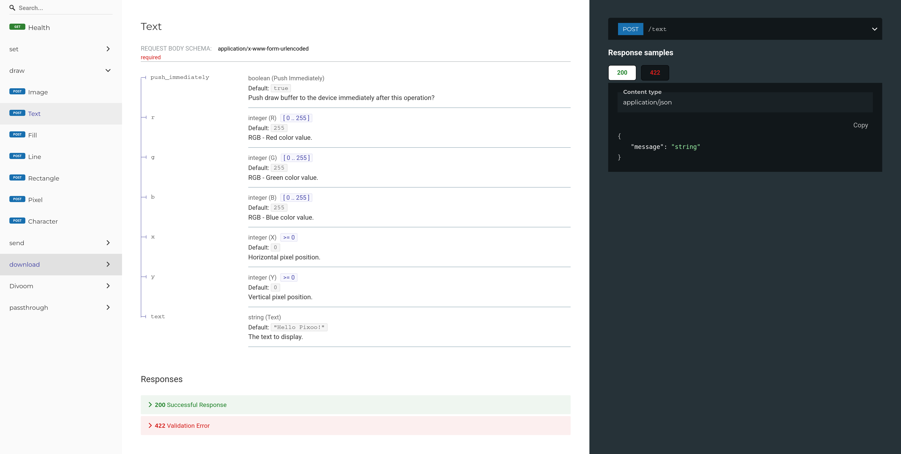

# Pixoo REST

> A RESTful API to easily interact with the Wi-Fi enabled [Divoom Pixoo](https://www.divoom.com/de/products/pixoo-64) devices.

---

:tada: **MAJOR UPDATE**

Beginning with version `2.0.0` this app now uses [FastAPI](https://fastapi.tiangolo.com/) (instead of _Flask_) to generate the Swagger UI.
This will not only make future updates and maintenance easier, but also (hopefully) improve the code base overall.

Configuration properties for _Pixoo REST_ have changed due to this migration.  
**Please make sure to read the [changelog](CHANGELOG.md) for details.**

---

:information_source: **GENERAL INFORMATION**  

This project was created back in February 2022; aiming to provide a REST-like interface for the [pixoo library](https://github.com/SomethingWithComputers/pixoo).  
With an [update from August 2024](https://github.com/SomethingWithComputers/pixoo/commit/9984e4dfea1cf60ae0ec2cd05a6d39fb40bd8644), the library's creator decided to implement/integrate a dedicated REST-interface himself.

However, **Pixoo REST** still offers unique features like ...

* built-in _Swagger_ and _ReDoc_ UI
* "pass through" endpoints (with example payloads and detailed descriptions)
* (pre-built) container image
* Helm chart
* regular dependency updates
* etc.

So... I'll keep maintaining the project as long as there's enough interest.

---

## Table of Contents

* [Introduction](#introduction)
* [Disclaimer](#disclaimer)
* [Changelog](#changelog)
* [Getting started](#getting-started)
   * [Clone](#clone)
   * [Init](#init)
   * [Configure](#configure)
* [Running](#running)
   * [Direct](#direct)
   * [Containerized](#containerized)
* [Usage](#usage)
   * [Examples](#examples)
* [License](#license)

## Introduction

The main purpose of this app is to provide an easy-to-use [Swagger UI](https://swagger.io/tools/swagger-ui/) to interact with your _Pixoo_ device.

Making it easier to ...

* :pencil2: **draw** pixels, lines, rectangles, and text
* :framed_picture: quickly **upload** images
* :film_strip: **play** animations using GIFs 
* :gear: **set** the device's channel, brightness, etc.
* :arrow_down: automatically **download** and display resources from a URL

... from your own applications or home-automation tasks.

**Pixoo REST** makes use of the great [Pixoo Python library](https://github.com/SomethingWithComputers/pixoo) by [SomethingWithComputers](https://github.com/SomethingWithComputers); which offers various helpful features like automatic image conversion. :thumbsup:

However, it is also possible to simply **pass through** raw JSON-data to the _Pixoo_'s built-in HTTP-API via this Swagger UI.  
(The Swagger UI will provide handy example payloads (for easy editing) in this case.) 

## Disclaimer

This REST API is by no means a by-the-books reference on how proper REST APIs should be implemented; but simply a "convenience wrapper" for the aforementioned _Pixoo_ library.

The actual HTTP API of the _Pixoo_ device leaves a lot to be desired.  
First and foremost proper/official documentation. :wink:  

Most of the **pass-through** payload objects got discovered via reverse engineering, trial-and-error, or this website:  
[doc.divoom-gz.com](http://doc.divoom-gz.com/web/#/12?page_id=143).

So...

:warning: Use at your own risk. :warning:

## Changelog

A (more or less) detailed changelog can be found here:  
:open_book: [Changelog](CHANGELOG.md)

## Getting started

### Clone

Clone this repo ...
```bash
git clone https://github.com/4ch1m/pixoo-rest.git
```
... and change directory:
```bash
cd pixoo-rest
```

### Init

Update/initialize the `pixoo` [submodule](.gitmodules):
```bash
git submodule update --init
```

### Configure

Create an `.env`-file (in the project's root) and put your individual settings in it; like so:
```properties
# MANDATORY: the hostname of your Pixoo device; defaults to "Pixoo64" if omitted
PIXOO_HOST=192.168.178.11

# OPTIONAL: the screen size of your Pixoo device (which gets passed to the Pixoo-library); defaults to "64" if omitted
PIXOO_SCREEN_SIZE=64

# OPTIONAL: enable debug mode for the Pixoo-library; defaults to "false" if omitted
PIXOO_DEBUG=true

# OPTIONAL: controls, whether a connection check to the Pixoo device should be performed upon application start
PIXOO_CONNECTION_CHECK=true

# OPTIONAL: the amount of retries that should be performed to connect to the Pixoo-device when starting the app; defaults to "infinity" when omitted
PIXOO_CONNECTION_CHECK_RETRIES=10

# OPTIONAL: enable (FastAPI) debug mode for the REST-app; defaults to "false" if omitted
PIXOO_REST_DEBUG=true

# OPTIONAL: configures the base-path/prefix-url (which may be needed when running behind a reverse proxy); defaults to an empty string if omitted
#PIXOO_REST_ROOT_PATH=/my-pixoo

# OPTIONAL: the official Divoom API URL (used for querying Divoom devices in your LAN, etc.); can be overridden if necessary
DIVOOM_API_URL=https://app.divoom-gz.com
```

## Running

The app can now be run ...
* :snake: directly; using your existing (venv-)Python installation

or

* :package: fully packaged inside a dedicated (Docker-)container

### Direct

> [!NOTE]
> Using Python version >= `3.14` is recommended.

Create a virtual environment and activate it (optional; but recommended):
```bash
python3 -m venv .venv
source .venv/bin/activate
```

Install all dependencies:
```bash
pip install -r requirements.txt
```

Finally, run the app via `fastapi`:
```bash
fastapi run pixoo_rest
```

You may change the default host (`0.0.0.0`) and port (`8000`) settings using additional parameters, e.g.:

```bash
fastapi run --host 127.0.0.1 --port 8080 pixoo_rest
```

### Containerized

Simply execute ...
```bash
docker compose up
```
... to automatically build the container and run it.

(If you want to change the port here, then just add the variable `PIXOO_REST_PORT` and your desired port to the `.env` file.)

Instead of building the container yourself, you also can use the pre-built image from [hub.docker.com](https://hub.docker.com/r/4ch1m/pixoo-rest).

Simply uncomment the `image`-attribute in [docker-compose.yml](docker-compose.yml), and comment out the `build`-attribute:

```yaml
  app:
    image: 4ch1m/pixoo-rest:latest
    #build: .
```

There's also a [Helm chart](helm) you can use for deployments to [K8s](https://kubernetes.io/).

## Usage

Open [http://localhost:8000](http://localhost:8000) in a web browser and make some requests using the [Swagger UI](https://swagger.io/):


NOTE:  
For every executed request you'll get a handy [curl](https://curl.se/) command-line (ideal for reuse in home-automation scripts).

####  :star: NEW :star:

A [ReDoc](https://github.com/Redocly/redoc) page is now also available via [http://localhost:8000/redoc](http://localhost:8000/redoc):



### Examples

A few example (shell-)scripts can be found here:  
:toolbox: [Examples](examples)

## Credits

* Example animation file ([duck.gif](examples/duck.gif)) by `kotnaszynce` / [OpenGameArt](https://opengameart.org/content/cute-duck-animated-set).
* Example pixel art image ([Heart_pixelart.png](examples/Heart_pixelart.png)) by `El Rolo Ueeqee` / [WikiMedia](https://de.wikipedia.org/wiki/Datei:Heart_pixelart.png).
* Smiley [favicon](static/favicon.ico) by `tulpahn` / [FlatIcon](https://www.flaticon.com/free-icons/smile).

## License

Please read the [LICENSE](LICENSE) file.
