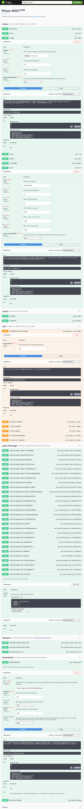

# Pixoo REST

> A RESTful API to easily interact with the Wi-Fi enabled [Divoom Pixoo](https://www.divoom.com/de/products/pixoo-64) devices.

---

:information_source: **INFORMATION**  

This project was created back in February 2022; aiming to provide a REST-like interface for the [pixoo library](https://github.com/SomethingWithComputers/pixoo).  
With an [update from August 2024](https://github.com/SomethingWithComputers/pixoo/commit/9984e4dfea1cf60ae0ec2cd05a6d39fb40bd8644), the library's creator decided to implement/integrate a dedicated REST-interface himself.

However, `pixoo-rest` still offers unique features like ...

* built-in Swagger UI
* "pass through" endpoints (with example payloads and detailed descriptions)
* (pre-built) container image
* Helm chart
* etc.

So... I'll keep maintaining the project as long as there's enough interest.

---

## Table of Contents

* [Introduction](#introduction)
* [Disclaimer](#disclaimer)
* [Changelog](#changelog)
* [Getting started](#getting-started)
   * [Clone](#clone)
   * [Init](#init)
   * [Configure](#configure)
* [Running](#running)
   * [Direct](#direct)
   * [Containerized](#containerized)
* [Usage](#usage)
   * [Examples](#examples)
* [License](#license)

## Introduction

The main purpose of this app is to provide an easy-to-use [Swagger UI](https://swagger.io/tools/swagger-ui/) to interact with your Pixoo device.

Making it easier to ...

* :pencil2: **draw** pixels, lines, rectangles, and text
* :framed_picture: quickly **upload** images
* :film_strip: **play** animations using GIFs 
* :gear: **set** the device's channel, brightness, etc.
* :arrow_down: automatically **download** and display resources from a URL

... from your own applications or home-automation tasks.

**Pixoo REST** makes use of the great [Pixoo Python library](https://github.com/SomethingWithComputers/pixoo) by [SomethingWithComputers](https://github.com/SomethingWithComputers); which offers various helpful features like automatic image conversion. :thumbsup:

However, it is also possible to simply **pass through** raw JSON-data to the Pixoo's built-in HTTP-API via this Swagger UI.  
(The Swagger UI will provide handy example payloads (for easy editing) in this case.) 

## Disclaimer

This REST API is by no means a by-the-books reference on how proper REST APIs should be implemented; but simply a "convenience wrapper" for the aforementioned Pixoo library.

The actual HTTP API of the Pixoo device leaves a lot to be desired.  
First and foremost proper/official documentation. :wink:  
Most of the **pass-through** payload objects got discovered via *reverse engineering*, try-and-error, or this website: [doc.divoom-gz.com](http://doc.divoom-gz.com/web/#/12?page_id=143).

:warning: Use at your own risk.

## Changelog

A (more or less) detailed changelog can be found here: [:open_book:](CHANGELOG.md)

## Getting started

### Clone

Clone this repo ...
```bash
git clone https://github.com/4ch1m/pixoo-rest.git
```
... and change directory:
```bash
cd pixoo-rest
```

### Configure

Create an `.env`-file alongside the [app.py](app.py)-file / [docker-compose.yml](docker-compose.yml)-file and put your individual settings in it; like so:
```properties
# MANDATORY: the hostname of your Pixoo device; defaults to "Pixoo64" if omitted
PIXOO_HOST=192.168.178.11

# OPTIONAL: enable debug mode for the Pixoo-library; defaults to "false" if omitted
PIXOO_DEBUG=true

# OPTIONAL: the screen size of your Pixoo device (which gets passed to the Pixoo-library); defaults to "64" if omitted
PIXOO_SCREEN_SIZE=64

# OPTIONAL: enable (Flask) debug mode for the REST-app; defaults to "false" if omitted
PIXOO_REST_DEBUG=true

# OPTIONAL: the hostname to listen on; defaults to "127.0.0.1" if omitted
PIXOO_REST_HOST=0.0.0.0

# OPTIONAL: the port being used; defaults to "5000" if omitted
PIXOO_REST_PORT=5000

# OPTIONAL: the amount of retries that should be performed to connect to the Pixoo-device when starting the app; defaults to "infinity" when omitted
PIXOO_TEST_CONNECTION_RETRIES=10

# OPTIONAL: WSGI-conform way to configure a base-path/prefix-url (which may be needed when running behind a reverse proxy); NOTE -> this string must start with a slash!
# (CAUTION! Only set this if you really need it.)
SCRIPT_NAME=/pixoo-rest
```

## Running

The app can now be run ...
* :snake: directly; using your existing (venv-)Python installation

or

* :package: fully packaged inside a dedicated (Docker-)container

### Direct

Create a virtual environment and activate it (optional; but recommended):
```bash
python3 -m venv venv
. venv/bin/activate
```

Install all dependencies:
```bash
pip install -r requirements.txt
```

Finally, run the app:
```bash
python app.py
```

### Containerized

Simply execute ...
```bash
docker compose up
```
... to automatically build the container and run it.

#### NEW :star:

If you don't want to build the container image yourself, you now can use the pre-built image from [hub.docker.com](https://hub.docker.com/r/4ch1m/pixoo-rest).

Simply uncomment the `image`-attribute in [docker-compose.yml](docker-compose.yml), and comment out the `build`-attribute:

```yaml
  app:
    image: 4ch1m/pixoo-rest:latest
    #build: .
```

There's also a [Helm chart](helm) you can use for deployments to [K8s](https://kubernetes.io/).

## Usage

Open [http://localhost:5000](http://localhost:5000) in a web browser and make some requests using the [Swagger UI](https://swagger.io/):



_NOTE:_  
For every executed request you'll get a handy [curl](https://curl.se/) command-line (ideal for reuse in home-automation scripts).

### Examples

A few example (shell-)scripts can be found here: [:toolbox:](examples)

## Credits

Example animation file ([duck.gif](swag/duck.gif)) by `kotnaszynce` / [OpenGameArt](https://opengameart.org/content/cute-duck-animated-set).

## License

Please read the [LICENSE](LICENSE) file.
